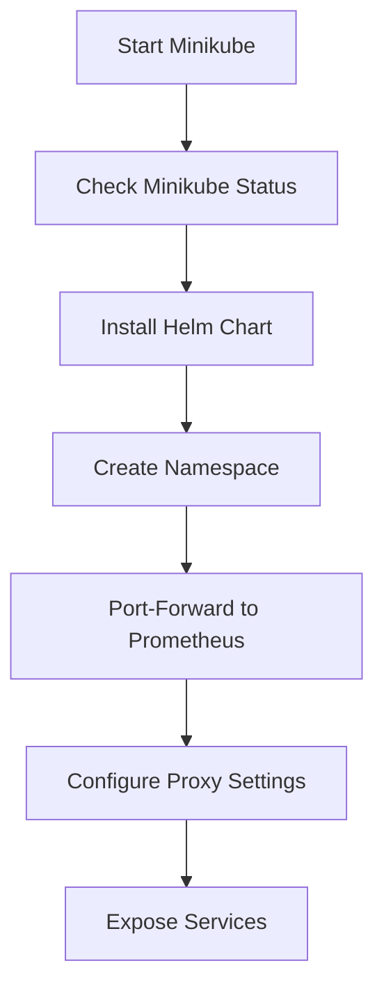
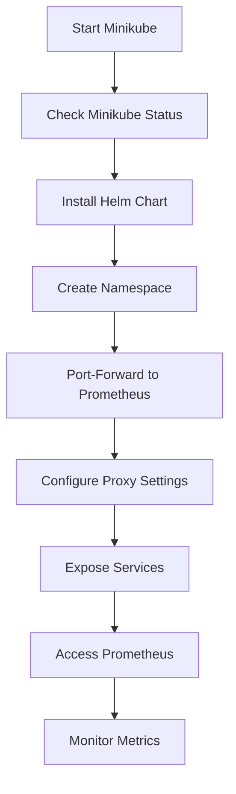

# Journey of Setting Up Minikube

## Steps Followed

1. **Start Minikube**
    - Command: `minikube start`
    - Reference: [Minikube Error](../7_%20Semblance/minikube.md)
    - Status: ✅ Done

2. **Check Minikube Status**
    - Command: `minikube status`
    - Reference: [Minikube Error](../7_%20Semblance/minikube.md)
    - Status: ✅ Done

3. **Install Helm Chart**
    - Command: `helm install prometheus bitnami/prometheus --namespace monitoring --set server.service.type=LoadBalancer --set alertmanager.enabled=false --set pushgateway.enabled=false`
    - Reference: [Helm Installation Error: Namespace Not Found](../7_%20Semblance/namespace_error.md)
    - Status: ✅ Done

4. **Create Namespace**
    - Command: `kubectl create namespace monitoring`
    - Reference: [Helm Installation Error: Namespace Not Found](../7_%20Semblance/namespace_error.md)
    - Status: ✅ Done

5. **Port-Forward to Prometheus**
    - Command: `kubectl port-forward svc/prometheus-server 9090:9090`
    - Reference: [Port Forwarding Prometheus](../5_Formula/port_forward.md)
    - Status: ✅ Done

6. **Configure Proxy Settings**
    - Reference: [Example Configuration (Nginx)](../5_Formula/why_I%20_cannot%20_login_to_gpt.md)
    - Status: ⏳ In-progress

7. **Expose Services**
    - Command: `helm install prometheus bitnami/prometheus --namespace monitoring --set server.service.type=LoadBalancer --set alertmanager.enabled=false --set pushgateway.enabled=false`
    - Reference: [Deploying Prometheus and Thanos Monitoring Stack](../5_Formula/helm_install.md)
    - Status: ⏳ In-progress

## Mermaid Chart

## Summary

This journey outlines the steps taken to set up Minikube, install Helm charts, create namespaces, and port-forward to Prometheus. The process includes configuring proxy settings and exposing services to ensure seamless access and monitoring of metrics.