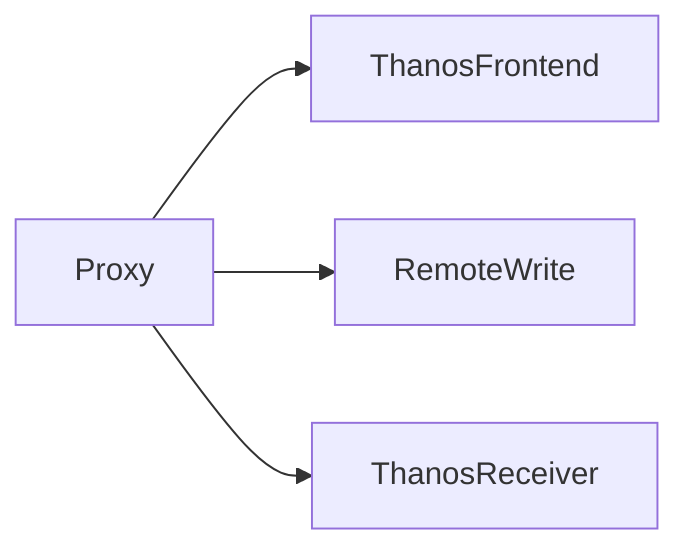

# Thanos Proxy Setup 🚀

## Goal 🎯
Set up a unified proxy to access:
- **Thanos Frontend** 🌐
- **Remote Write** ✍️
- **Thanos Receiver** 📥

## Enhancing Prometheus for Long-Term Storage 💾
Thanos extends Prometheus by providing scalable and durable long-term storage, ensuring that your metrics data is preserved and accessible over extended periods.

## Components Overview 🛠️

### Thanos Frontend 🌐
A web interface to visualise metrics and graphs effortlessly.  
🖥️ Accessible via proxy with secure authentication and low latency.

### Remote Write ✍️
Enables sending metrics data to Thanos for centralized storage.  
📡 Ensure data ingestion works flawlessly through the proxy with 99.9% availability.

### Thanos Receiver 📥
Handles incoming metrics data efficiently for processing and storage.  
📥 Fully functional via proxy with real-time updates and error-free data flow.

## Architecture Diagram 📊

## Key Results 🏆
- **Seamless Access**: Easily reach Thanos Frontend through the proxy.
- **Reliable Data Transmission**: Ensure metrics are sent without loss via Remote Write.
- **Efficient Data Reception**: Smoothly receive and process data with Thanos Receiver.
- **Scalable Storage**: Thanos scales horizontally to handle large volumes of metrics data.
- **High Availability**: Maintains metrics system availability even during failures.
- **Cost-Effective Long-Term Retention**: Utilises object storage to store metrics data cost-effectively over long periods.
- **Secure and Low Latency Access for Frontend**: Accessible via proxy with secure authentication and low latency.
- **High Availability Data Ingestion**: Ensure data ingestion works flawlessly through the proxy with 99.9% availability.
- **Real-Time and Error-Free Data Flow for Receiver**: Fully functional via proxy with real-time updates and error-free data flow.