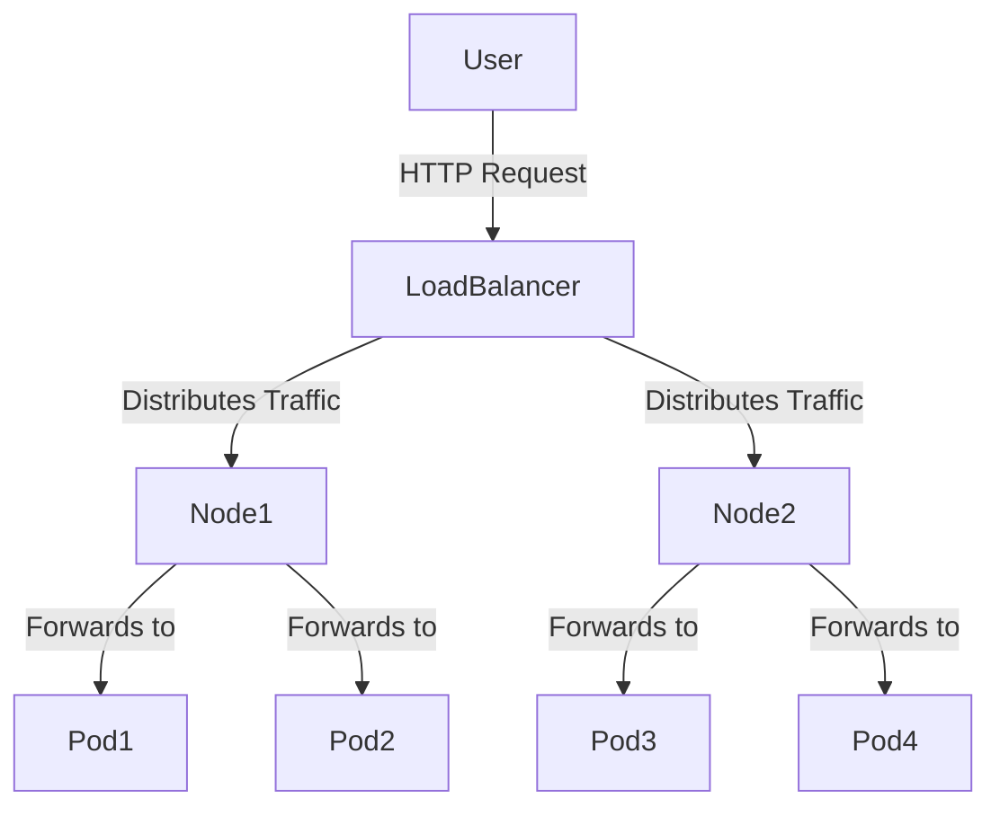

# Difference Between NodePort and LoadBalancer

In Kubernetes, both `NodePort` and `LoadBalancer` are types of services used to expose applications running in a cluster. Here are the key differences between them:

## NodePort

- **Access**: Exposes the service on a static port on each node's IP address.
- **Port Range**: Uses a port from the range 30000-32767.
- **Usage**: Suitable for development, testing, or when you have an external load balancer.
- **Configuration**: 
    ```yaml
    apiVersion: v1
    kind: Service
    metadata:
      name: my-service
    spec:
      type: NodePort
      selector:
        app: MyApp
      ports:
        - protocol: TCP
          port: 80
          targetPort: 8080
          nodePort: 30007
    ```

## LoadBalancer

- **Access**: Provisions an external load balancer (e.g., AWS ELB, GCP LB) to route traffic to the service.
- **Port Range**: Uses any port specified in the service definition.
- **Usage**: Ideal for production environments where you need a stable external IP.
- **Configuration**: 
    ```yaml
    apiVersion: v1
    kind: Service
    metadata:
      name: my-service
    spec:
      type: LoadBalancer
      selector:
        app: MyApp
      ports:
        - protocol: TCP
          port: 80
          targetPort: 8080
    ```

## Summary

- **NodePort**: Exposes the service on each node's IP at a static port. Suitable for simple setups or when using an external load balancer.
- **LoadBalancer**: Provisions an external load balancer to expose the service. Suitable for production environments requiring a stable external IP.

Choose the appropriate service type based on your environment and requirements.

```
helm install prometheus bitnami/prometheus \
>     --namespace monitoring \
>     --set server.service.type=LoadBalancer \
>     --set alertmanager.enabled=false \
>     --set server.service.nodePort=9090 

