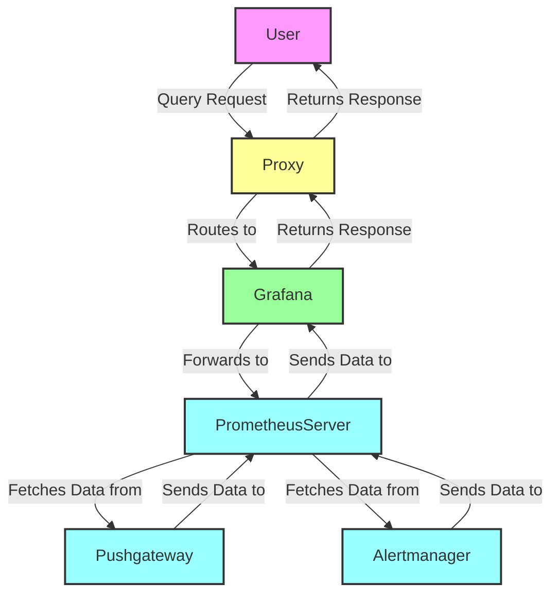

# Difference Between NodePort and LoadBalancer

In Kubernetes, both `NodePort` and `LoadBalancer` are types of services used to expose applications running in a cluster. Here are the key differences between them:

## NodePort

- **Access**: Exposes the service on a static port on each node's IP address.
- **Port Range**: Uses a port from the range 30000-32767.
- **Usage**: Suitable for development, testing, or when you have an external load balancer.
- **Configuration**: 
  ```yaml
  apiVersion: v1
  kind: Service
  metadata:
    name: my-service
  spec:
    type: NodePort
    selector:
    app: MyApp
    ports:
    - protocol: TCP
      port: 80
      targetPort: 8080
      nodePort: 30007
  ```

## LoadBalancer

- **Access**: Provisions an external load balancer (e.g., AWS ELB, GCP LB) to route traffic to the service.
- **Port Range**: Uses any port specified in the service definition.
- **Usage**: Ideal for production environments where you need a stable external IP.
- **Configuration**: 
  ```yaml
  apiVersion: v1
  kind: Service
  metadata:
    name: my-service
  spec:
    type: LoadBalancer
    selector:
    app: MyApp
    ports:
    - protocol: TCP
      port: 80
      targetPort: 8080
  ```

## Summary

- **NodePort**: Exposes the service on each node's IP at a static port. Suitable for simple setups or when using an external load balancer.
- **LoadBalancer**: Provisions an external load balancer to expose the service. Suitable for production environments requiring a stable external IP.

Choose the appropriate service type based on your environment and requirements.


The main difference between `NodePort` and `LoadBalancer` services in Kubernetes is how they expose the application:

- **NodePort**: Exposes the service on each node's IP at a static port. It uses the node's IP address and a specific port to make the service accessible. This is suitable for development and testing environments.
- **LoadBalancer**: Provisions an external load balancer to expose the service. It provides a stable external IP address and URL, making it ideal for production environments. The load balancer distributes traffic to the nodes, which then forward it to the appropriate pods.

In summary, `NodePort` is simpler and uses node IPs, while `LoadBalancer` provides a more robust solution with an external IP and load balancing capabilities.

## Prometheus Communication via Proxy

In a Prometheus setup, different components like the Prometheus Server, Alertmanager, Pushgateway, and Grafana communicate with each other through a proxy. This setup ensures that all traffic is routed correctly and efficiently.

### Components

- **Prometheus Server**: Scrapes and stores metrics data.
- **Alertmanager**: Handles alerts generated by Prometheus.
- **Pushgateway**: Allows ephemeral and batch jobs to push metrics to Prometheus.
- **Grafana**: Visualizes metrics data stored in Prometheus.

### Communication Flow

1. **User Request**: A user sends a query request to Grafana.
2. **Proxy Routing**: The proxy routes the request to the Prometheus Server.
3. **Component Interaction**: The Prometheus Server interacts with Alertmanager and Pushgateway to process the request and retrieve the necessary data.
4. **Response**: The data is sent back through the proxy to Grafana, which then returns the response to the user.

### Mermaid Diagram



### Summary

- **Proxy**: Routes requests to the appropriate Prometheus components.
- **Grafana**: Handles user queries and forwards them to Prometheus Server.
- **Prometheus Server**: Scrapes and stores metrics data, and interacts with Pushgateway and Alertmanager.
- **Pushgateway**: Allows ephemeral and batch jobs to push metrics to Prometheus.
- **Alertmanager**: Handles alerts generated by Prometheus.

This setup ensures efficient communication and data retrieval in a Prometheus environment, making it easier to manage and scale.
